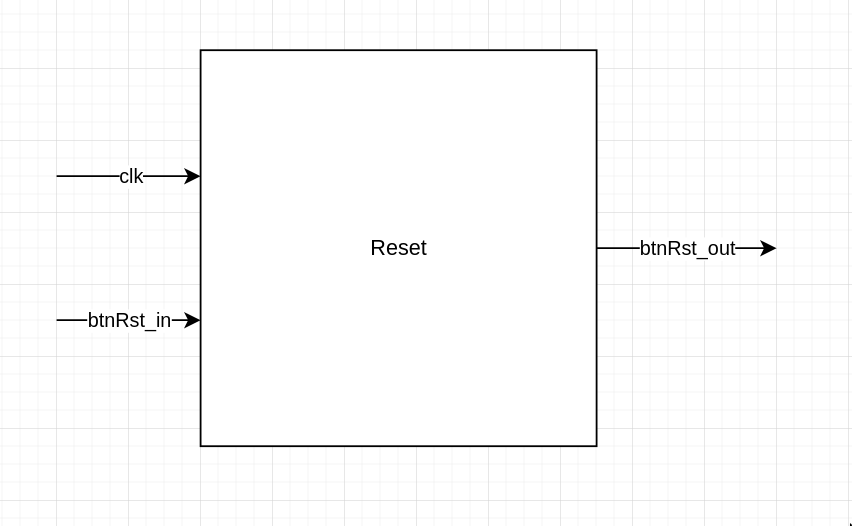
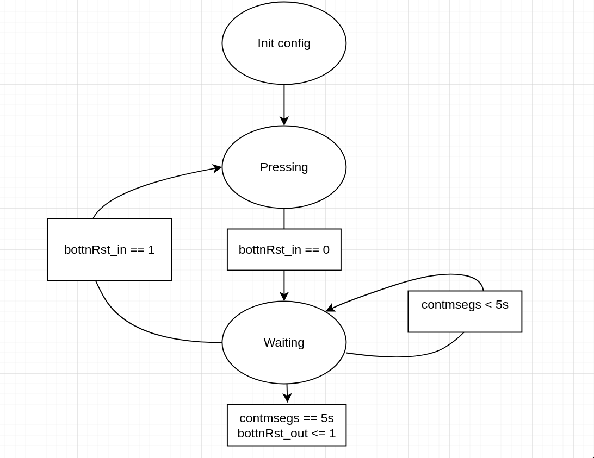
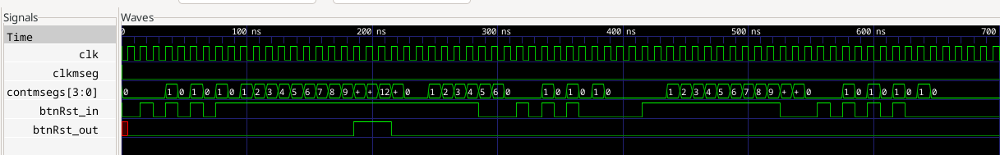
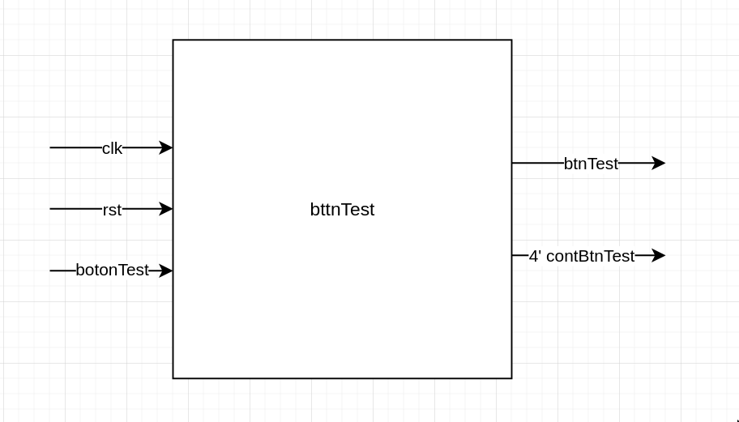
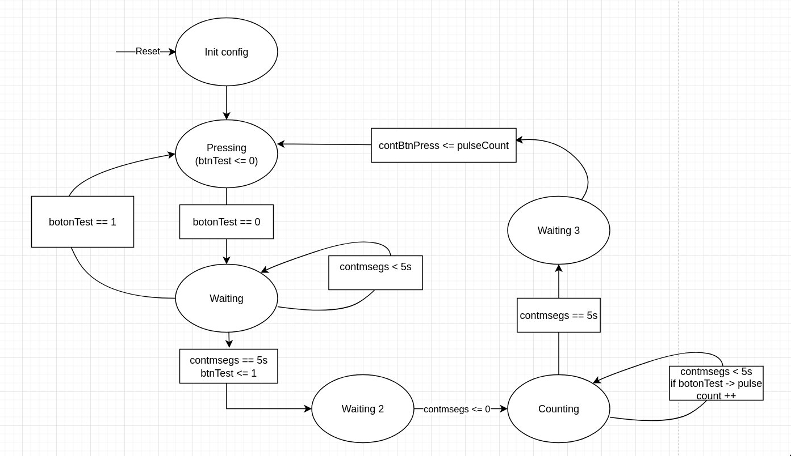
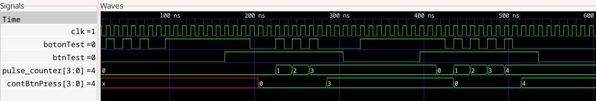
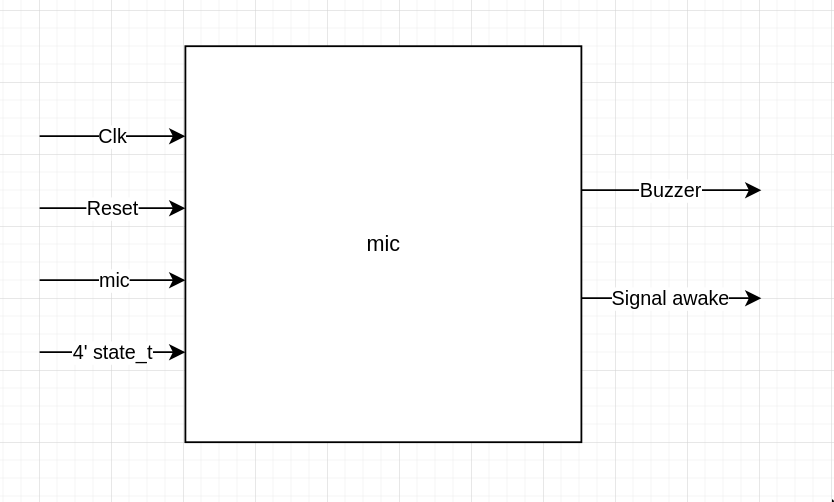
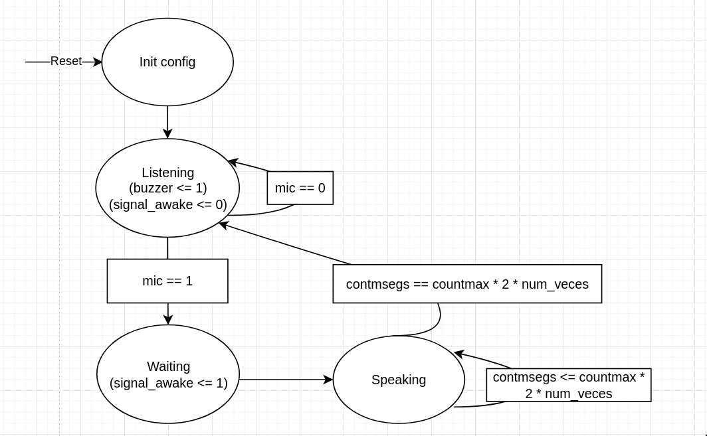
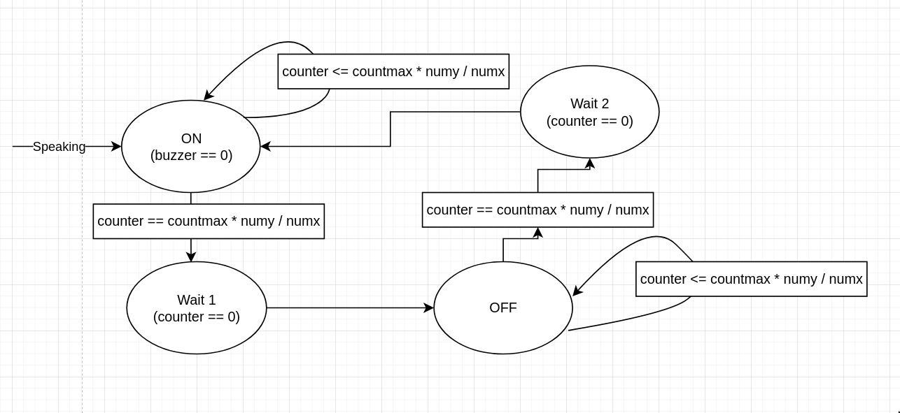
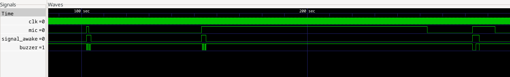

## **En este archivo se explicará la realización de los modulos de botones Test y Reset junto con el modulo de microfono/buzzer**

- [Modulo antirebote](#modulo-antirebote)
- [Botón Reset](#botón-reset)
  - [Diagrama de caja negra](#diagrama-de-caja-negra)
  - [Diagrama de estados](#diagrama-de-estados)
  - [Pruebas TestBench](#pruebas-testbench)
- [Botón Test](#botón-test)
  - [Diagrama de caja negra](#diagrama-de-caja-negra-1)
  - [Diagrama de estados](#diagrama-de-estados-1)
  - [Pruebas TestBench](#pruebas-testbench-1)
- [Modulo microfono y buzzer](#modulo-microfono-y-buzzer)
  - [Diagrama de caja negra](#diagrama-de-caja-negra-2)
  - [Diagrama de estados](#diagrama-de-estados-2)
  - [Pruebas TestBench](#pruebas-testbench-2)

# Modulo antirebote
Para la utilización de botones en el proyecto, utilizamos un modulo antirebote que nos permite mitigar el ruido mecanico de los botones utilizados para la utilización de las entradas necesarias.

```verilog
module BotonAntirebote #(parameter MIN_TIME = 5000)(
    input wire clk, // Clock input in ms
    input wire btn_in, // Button input
    output wire btn_out // Debounced button output
);

    reg btn_state = 1'b0; // Current state of the button
    reg btn_prev = 1'b0; // Previous state of the button
    reg [$clog2(MIN_TIME*2)-1:0] counter = 0; // Counter for debouncing
	 

    always @(posedge clk) begin
        if (btn_in != btn_prev) begin
            btn_prev <= btn_in;
            btn_state <= 0;
        end 
        
        if (btn_in == 1) begin // previus state is also 1
            counter <= counter + 1; 
            if (counter >= (MIN_TIME - 1)) begin
                btn_state <= 1;
                counter <= 0;
            end
        end else begin
            counter <= 0;
        end
    end

    assign btn_out = btn_state;
endmodule
```

# Botón Reset
El modulo de botón de reset, cumple con las especificaciones dadas, se debe de pulsar por 5 segundos un botón que ocasiona que el Tamagotchi vuelva a su estado inicial, "IDLE", además el reset se compartirá por los modulos utilizados en todo el sistema, generando la lógica necesaria para volver a un estado inicial a los distintos sensores del Tamagotchi. 

## Diagrama de caja negra
A continuación se puede ver el diagrama de caja negra general de el modulo Reset.



Cómo se puede ver en el diagrama, es necesario el clock y la entrada de botón para la lógica que nos permite dar un 1 lógico cuando el botón se oprime por 5 segundos, además, es importante recalcar que se debe de combinar con el modulo antirebote visto anteriormente, que permite utilizar los botones de la FPGA.

```verilog
module bttnReset #(parameter COUNT_MAX = 25000000, FiveSegs = 9)(
    // Declaración de entradas y salidas
    input btnRst_in,
    input clk,
    output reg btnRst_out
);
```

Cómo se puede ver en la definición del modulo, existen 2 parametros, un contador que llega a contar 0.5 segundos y un contador de 5 segundos, que está por defecto como 9, es decir 4.5 segundos, esto debido al retraso que se da por el modulo antirebote, para completar los 5 segundos de la especificación.

## Diagrama de estados

A continuación se puede ver el diagrama de estados del botón de reset.



cómo se puede ver, se cuenta con 2 estados, el estado de PRESSING que espera a que el botón se oprima, y el estado WAITING que espera 5 segundos para actualizar la salida a un 1 lógico, o de lo contrario se encarga de verificar que el botón de entrada siga siendo pulsado o lo manda al estado de PRESSING a esperar una nueva pulsación, se puede ver la lógica a continuación:

```verilog
// Cambio entre estados
always @(posedge clk) begin
	case(state)
        PRESSING: begin
            if (!btnRst_in) begin
                next <= WAITING;
            end else begin
                next <= PRESSING;
            end
        end
        WAITING: begin
            if (btnRst_in) begin
                next <= PRESSING;
            end else begin
                if (contmsegs <= COUNT_MAX * FiveSegs * 2) begin
                    next <= WAITING;
                end else begin
                    next <= PRESSING;
                end
            end
        end
    endcase
end

```

```verilog
// Lógica en los estados
always @(posedge clk) begin
    case(next)
        PRESSING: begin
            btnRst_out <= 0;
            flag_contmsegs <= 1'b0;
        end
        WAITING: begin
            flag_contmsegs <= 1'b1;
            if (!btnRst_in) begin
                if (contmsegs == COUNT_MAX * FiveSegs - 1) begin
                    btnRst_out <= 1;
				end
            end
        end
    endcase
end
```

## Pruebas TestBench
Para la realización del modulo se utilizó el siguiente TestBench para comprobar su debido funcionamiento:

```verilog
bttnReset #(1, 10) uut(
        .clk(clk),
        .btnRst_in(btnRst_in),
        .btnRst_out(btnRst_out)
    );

    // Clock generation
	always #5 clk = ~clk;

    initial begin
        clk = 0;
        btnRst_in = 0;
        #5

        #10 btnRst_in = 1;
        #10 btnRst_in = 0;

        #10 btnRst_in = 1;
        #10 btnRst_in = 0;

        #10 btnRst_in = 1;
        #10 btnRst_in = 0;

        #10 btnRst_in = 1;
        #210 btnRst_in = 0;

        #30 btnRst_in = 1;
        #10 btnRst_in = 0;

        #10 btnRst_in = 1;
        #10 btnRst_in = 0;

        #10 btnRst_in = 1;
        #10 btnRst_in = 0;

        #50 btnRst_in = 1;
        #210 btnRst_in = 0;

        #30 btnRst_in = 1;
        #10 btnRst_in = 0;

        #10 btnRst_in = 1;
        #10 btnRst_in = 0;

        #10 btnRst_in = 1;
        #10 btnRst_in = 0;

        #10 btnRst_in = 1;
        #10 btnRst_in = 0;

    end
```

Como se puede ver se utilizan parametros pequeños para poder simularlo y verlo en las señales de reloj, encontrando los siguientes resultados:



La simulación muestra un buen comportamiento, el que solo se manda el 1 lógico como salida al haber oprimido el botón por más de 10 ciclos de contmseg que empiezan a contar en el momento en que se presiona el botón.

# Botón Test

El botón de Test tiene una lóogica parecida al botón de Reset, en el cúal se debe presionar 5 veces el botón para entrar al modo Test, sin embargo, este al entrar al modo Test tendrá otros 5 segundos para oprimir el botón un numero de veces de 1 a 9 veces, que se mandará a la máquina de estados para forzar un cambio de estados.

## Diagrama de caja negra

Se puede ver a continuación el diagrama de caja negra para el botón Test:




```verilog
module bttnTest #(parameter COUNT_MAX = 25000000,FiveSegs = 9)(
    // Declaración de entradas y salidas
    input botonTest,
    input clk,
    input rst,
    output reg btnTest,
    output reg [3:0] contBtnPress
);
```
Se observa cómo en este botón si se presenta un reset, que permitirá volver contBtnPress a un estado inicial, siedo este registro un contador de las veces que se pulsó para saber que estado eligió el usuario.

## Diagrama de estados

A continuación se muestra el diagrama de estados para el modulo del botón Test.



Cómo se puede ver el diagrama de estados es similar al de botón Reset, sin embargo, se adicionan 3 estados, WAITING2 para resetear el contador y poder usarlo nuevamente, COUNTING en donde el usuario tiene 5 segundos para presionar el botón al numero que desee que representará un estado, y WAITING3 en el que se le da valor a la salida con el numero de veces que se presionó el botón en el anterior estado.

Se puede ver la descripción de hardware a continuación:

```verilog
// Lógica cambio de estados
always @(posedge clk) begin
	case(state)
        PRESSING: begin
            if (!botonTest) begin
                next <= WAITING;
            end else begin
                next <= PRESSING;
            end
        end
        WAITING: begin
            if (botonTest) begin
                next <= PRESSING;
            end else begin
                if (contmsegs <= COUNT_MAX * FiveSegs - 1) begin
                    next <= WAITING;
                end else begin
                    next <= WAITING2;
                end
            end
        end
        WAITING2: begin
            next <= COUNTING;
        end
        COUNTING: begin
            if (contmsegs <= COUNT_MAX * FiveSegs - 1) begin
                next <= COUNTING;
            end else begin
                next <= WAITING3;
            end
        end
        WAITING3: begin
            next <= PRESSING;
        end
    endcase
```

```verilog
// Lógica en cada estado
always @(posedge clk) begin
    case(next)
        PRESSING: begin
            btnTest <= 0;
            flag_contmsegs <= 1'b0;
        end
        WAITING: begin
            flag_contmsegs <= 1'b1;
            if (!botonTest) begin
                if (contmsegs == COUNT_MAX * FiveSegs - 1) begin
                    btnTest <= 1;
                end
            end
        end
        WAITING2: begin
            flag_contmsegs <= 1'b0;
				pulse_counter <= 0;
        end
        COUNTING: begin
			contBtnPress <= 0;
            flag_contmsegs <= 1'b1;
            if (!botonTest && prevBotonTest) begin
                pulse_counter <= pulse_counter + 1;
        end
        end
        WAITING3: begin
            contBtnPress <= pulse_counter;
        end
    endcase
    prevBotonTest <= botonTest;
end
```

## Pruebas TestBench

Para comprobar su funcionamiento se realizan pruebas con el siguiente TestBench:

```verilog
bttnTest #(1, 5) uut(
        .clk(clk),
        .rst(rst),
        .botonTest(botonTest),
        .btnTest(btnTest)
    );

    // Clock generation
	always #5 clk = ~clk;

    initial begin
        clk = 0;
        botonTest = 0;
        #5
        rst = 1;
        #10 rst = 0;

        #10 botonTest = 1;
        #10 botonTest = 0;

        #10 botonTest = 1;
        #10 botonTest = 0;

        #10 botonTest = 1;
        #10 botonTest = 0;

        #20 botonTest = 1;
        #100 botonTest = 0;

        #30 botonTest = 1;
        #10 botonTest = 0;

        #10 botonTest = 1;
        #10 botonTest = 0;

        #10 botonTest = 1;
        #10 botonTest = 0;

        #50 botonTest = 1;
        #100 botonTest = 0;

        #30 botonTest = 1;
        #10 botonTest = 0;

        #10 botonTest = 1;
        #10 botonTest = 0;

        #10 botonTest = 1;
        #10 botonTest = 0;

        #10 botonTest = 1;
        #10 botonTest = 0;

    end
```

Encontrando el siguiente resultado:



Como se puede ver, al igual que en el anterior, el TestBench fue probado con la lógica sin negar, luego al utilizarlo con la FPGA se niega la lógica del botón de entrada, se puede ver su buen funcionamiento en el que entra a test si se oprime el botón por más de 5 señales de clkmseg y luego por otras 5 señales se adiciona el numero de veces que se oprimió para seleccionar un estado con el output contBtnPress.

# Modulo microfono y buzzer
El modulo de microfono, nos sirve para obtener la señal de un sensor KY038 y hacer dos acciones, primero, dependiendo del estado el tamagotchi al detectar que se está "hablando con el" responderá con distintos sonidos en el buzzer, que simulará una respuesta por parte del Tamagotchi y esta será diferente dependiendo de su estado de animo o en su defecto, si está muerto, responderá con un pitido largo simulando el sonido de un electrocardiograma cuando el corazón para, además, nos servirá para despertarlo cuando se encuentre en el estado de dormir y por ultimo al utilizar el reset se activará el buzzer para indicar que se ha reseteado el Tamagotchi.

## Diagrama de caja negra
Se puede ver el diagrama de caja negra del modulo a continuación:




```verilog
module mic #(parameter COUNT_MAX = 25000000) (
    input mic,
    input clk,
    input rst,
    input [3:0] state_t,
    output reg buzzer,
    output reg signal_awake
);
```

Se encuentran de entradas el reloj, el reset, la señal mic del sensor y el estado del Tamagotchi actual como state_t con el cual se modificarán registros que permitan variar los contadores y por ende la señal de buzzer de salida.

## Diagrama de estados

El modulo de microfono cuenta con dos maquinas de estados, la primera del funcionamiento general que controla cuando el Tamagotchi va a responder al usuario y a mandar la señal para despertar, y la segunda dentro de SPEAKING que permitirá variar entre el estado de 0 y 1 al buzzer para que de distintos patrones de sonidos.

En la siguiente figura se puede ver el funcionamiento en general y como actúa la señal de despertar al Tamagotchi.



En la siguiente figura, se muestra el funcionamiento del Tamagotchi al entrar al estado SPEAKING en el que varía entre ON y OFF con un contador que se multiplica por unos registros que se definen anteriormente dependiendo del estado actúal del Tamagotchi.



```verilog
// Cambio de estados general
always @(negedge clk) begin
    case (state)
        LISTENING: begin
            next_state = (mic == 1 && prev_mic == 0)? WAITING : next_state;
        end
        WAITING: begin
            next_state = SPEAKING;
        end 
        SPEAKING: begin
            next_state = (contmsegs == (COUNT_MAX*num_veces*2)-1)? LISTENING : next_state;
        end
        default: begin
            next_state = LISTENING;
        end
    endcase
    prev_mic <= mic;
end
```

```verilog
// Función de cada estado
always @(posedge clk or negedge rst) begin
    if (!rst) begin
        counter <= 0;
        buzzer <= 0;
        next <= ON;
        flag <= 0;
    end else begin
        case (next_state)
            LISTENING: begin
                buzzer <= 1;
                signal_awake <= 0;
                flag = 0;
            end
            WAITING: begin
                signal_awake <= 1;
                flag = 1;
                counter <= 0;
            end
            SPEAKING: begin
                // Maquina de estados dentro de SPEAKING
                case(next)
                ON: begin
                        next <= (counter == ((COUNT_MAX-1) * num_y_tiempo / nunm_tiempo))? WAIT1 : ON;
                        buzzer <= 0;
                        counter <= counter + 1;
                    end
                WAIT1: begin
                    counter <= 0;
                    next <= OFF;
                end
                OFF: begin
                        next <= (counter == ((COUNT_MAX-1) * num_y_tiempo / nunm_tiempo))? WAIT2 : OFF;
                        counter <= counter + 1;
                        buzzer <= 1;
                    end
                WAIT2: begin
                    counter <= 0;
                    next <= ON;
                end
            endcase 
            end
        endcase
    end
end
```
Y por último se puede ver la lógica del tiempo de los contadores y cómo varían con el estado del Tamagotchi.
```verilog
always @(posedge clk)begin
    if(state_t == 0 || state_t == 1) begin
        num_veces <= 3;
        nunm_tiempo <= 2;
		  num_y_tiempo <= 1;
    end else if(state_t==5) begin
        num_veces <= 2;
        nunm_tiempo <= 1;
		  num_y_tiempo <= 1;
    end else if(state_t==4)begin
        num_veces <= 2;
        nunm_tiempo <= 2;
		  num_y_tiempo <= 1;
    end else if (state_t == 2)begin
        num_veces <= 1;
        nunm_tiempo <= 1;
		  num_y_tiempo <= 1;
    end else if (state_t == 8)begin
			num_veces <= 3;
			nunm_tiempo <= 1;
			num_y_tiempo <= 3;
	end else if (state_t == 3)begin
			num_veces <= 1;
			nunm_tiempo <= 2;
			num_y_tiempo <= 1;	
	 end else begin
        num_veces <= 2;
        nunm_tiempo <= 1;
        num_y_tiempo <= 3;
    end
end
```

## Pruebas TestBench
Se simula para comprobar su funcionamiento de la siguiente forma:

```verilog
mic #(50) uut(
        .clk(clk),
        .rst(rst),
        .mic(mic),
        .state_t(state_t),
        .buzzer(buzzer),
        .signal_awake(signal_awake)
    );

    // Clock generation
	always #5 clk = ~clk;

    initial begin
        clk = 0;
        mic = 0;
        state_t = 0;
        rst = 1;
        #1000 rst = 0;
        #1000 rst = 1;

        #100 state_t = 8;
        #100000 mic = 1;
        #1000 mic = 0;


        #10 state_t = 4;

        #50000 mic = 1;
        #100000 mic = 0;

        #100state_t = 2;
        #20000 mic = 1;
        #10000 mic = 0;
    end
```

Obteniendo los siguientes resultados:



Como se puede observar, el microfono varía dependiendo del estado en el que se encuentre para darle distintas señales al buzzer, además se agregó que si el microfono se mantiene prendido no vuelva a mandar la señal al buzzer para que si el microfono se encuentra muy sensible, deje de sonar el buzzer hasta que manualmente se ajuste su sensibilidad.