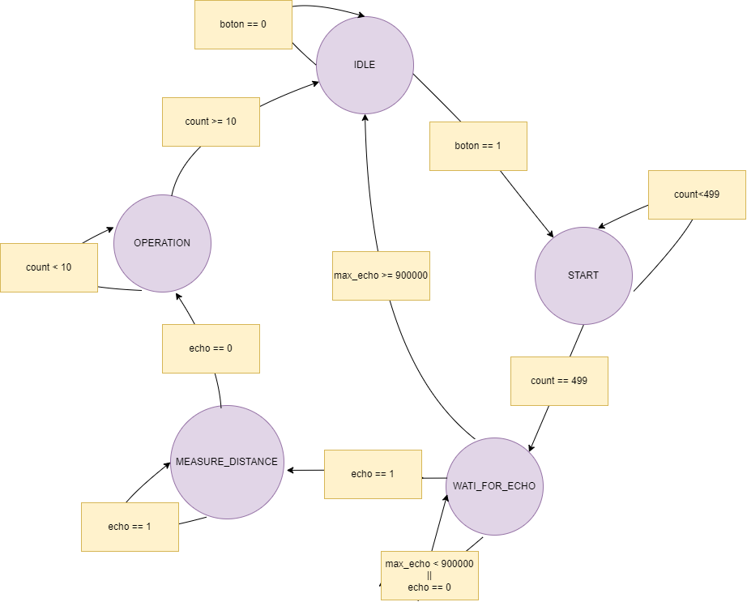

# Sensor de Distancia: HC-SR04

El HC-SR04 es un sensor de distancia por ultrasonido utilizado para medir la distancia entre el sensor y un objeto con una alta precisión, ya que es capaz de medir distancias en milímetros, centímetros e incluso hasta 4 metros de manera satisfactoria. Funciona enviando una señal de ultrasonido a través de un transductor; la onda golpea el objeto frente al sensor y se refleja para ser detectada por el transductor receptor. El tiempo que tarda la onda en regresar se mide y se utiliza para calcular la distancia del objeto.

## Descripción de hardware

El sensor de ultrasonido cuenta con 4 pines (VCC, GND, ECHO, TRIG), cada uno con una función específica para el funcionamiento del dispositivo.

VCC corresponde a la alimentación del sensor, que debe ser de 5V DC, mientras que el GND debe conectarse a tierra. El HC-SR04 no dispone de LED ni indicadores que permitan confirmar visualmente su funcionamiento, lo que puede dificultar su uso y la verificación de que está en operación.

### ECHO

El pin ECHO es una salida del sensor, es decir, una entrada para el dispositivo de control que se esté utilizando. A través de este pin se recibe la señal reflejada por el objeto. La distancia se calcula utilizando esta señal, mediante la siguiente ecuación:

$$
\text{distancia} = \frac{\text{Vel Sonido X}  \text{  ECHO}}{2}
$$

En el código implementado, la distancia se calcula utilizando la velocidad del sonido en cm/s, que es de aproximadamente 34300 cm/s (en lugar de 3400, que sería incorrecto). El pin ECHO proporciona el tiempo durante el cual está activo. Este tiempo se determina a partir del periodo de la frecuencia de la FPGA (50 MHz), multiplicado por el número de periodos que abarca el ECHO, de la siguiente manera:

$$
\text{ECHO} = 2 \times 10^{-8} \times \text{número de ciclos}
$$

Todo este proceso de medición se lleva a cabo en la máquina de estados, en el estado denominado "MEASURE_DISTANCE". Sin embargo, antes de que el sensor de ultrasonido pueda emitir la onda, es necesario realizar un proceso previo, que se explica a continuación:

### TRIG

Este pin es una entrada del HC-SR04, es decir, una salida de la unidad de control. Es el encargado de activar el sensor de ultrasonido, ya que el HC-SR04 solo emitirá la onda ultrasónica si recibe previamente una señal positiva de exactamente 10 µs a través del pin TRIG. Solo se emitirá una onda ultrasónica cada vez que reciba esta señal específica. Por lo tanto, el código debe enviar repetidamente la señal de 10 µs al pin TRIG para medir la distancia de manera constante, según lo requerido en nuestra aplicación.

Este proceso de enviar el trigger se realiza en la máquina de estados, en el estado "START", utilizando un contador que cuenta 499 ciclos de la señal del CLOCK, que tiene una frecuencia de 50 MHz, lo que es equivalente a 10µs.

### Funcionamiento
El sensor de ultrasonido debe detectar un objeto a una distancia menor de 10 cm durante al menos 1 segundo para luego enviar un 1 al output denominado "led". Si el objeto se encuentra a una distancia superior a 10 cm, no se contará el segundo necesario para activar el output, y se enviará un 0 en su lugar. Si el objeto está cerca por menos de 1 segundo y luego se retira, el output no enviará un 1; el conteo del tiempo se reiniciará. Si el objeto permanece cerca durante más de 1 segundo, el output enviará un 1 solo durante un ciclo; el resto del tiempo que el objeto permanezca cerca, el output se mantendrá en 0. Por lo tanto, para generar múltiples pulsos de 1 en el output, es necesario poner y retirar el objeto repetidamente.

En la máquina de estados, en el estado denominado "OPERATION", se evalúa si la distancia es mayor o menor de 10 cm. Dependiendo de esta evaluación, se asigna un valor al registro "act", que controla la habilitación o deshabilitación del conteo de un segundo. Este conteo se gestiona en un bloque always mediante un contador llamado "countbeat", que incrementa cada ciclo cuando el registro "act" es 0 y se reinicia cuando "act" es 1. En el mismo bloque always, hay una condición que asigna un 1 al output "led" si el contador alcanza 25,000,000, que equivale a 1 segundo.

Finalmente, en el estado "WAIT_FOR_ECHO", se añade un contador llamado "max_echo" que mide los ciclos necesarios para detectar el eco del dispositivo HC-SR04. Dado que el rango máximo de detección es de 4 metros, se calcula el tiempo necesario para superar este rango, que es de 900,000 ciclos. Si el contador excede este valor, se reinicia el proceso y se regresa al estado "IDLE", ya que si el objeto está demasiado lejos, el eco no será detectado. Esto evita que el sensor se quede estancado en el proceso de medición.

Para aclarar una parte del código que puede resultar confusa, la metodología para pasar del estado "IDLE" al estado "START" está condicionada a que un registro llamado "boton" sea igual a 1. En el código actual, se ha definido que este registro siempre será 1. Esto se hace para facilitar el desarrollo y en caso de que la especificación requiera que el sensor de ultrasonido solo se active al presionar un botón, el registro "boton" puede ser reemplazado por una entrada asociada a un botón físico.

### Estados

Imagen del diagrama de estados del ultrasonido:

Código con la logica del cambio de estados de la maquina de estas:

Código de las funciones dentro de cada uno de los estados:

Bloque always en el que se implementa la lógica para el output: 

## Simulación
Para la simulación se reduce el tiempo de espera para enviar el output "led" a 1 de 50000000 a 500.

En la primera imgaen se aprecia como empieza a aumentar el contador "counteat" ya que el contador que mide los ciclos no superó el valor definido que es de 73000.

Luego al llegar el contador "counteat" a 500 se envia un pulso que dura 1 ciclo al output "led" y a pesar que el contador sigue aumentando no se vuelve a enviar este pulso, esto se puede percibir en la siguiente imagen:

En la siguiente imagen se puede observar el comportamiento del sistema cuando se coloca un objeto a una distancia superior a 10 cm inmediatamente después de haberlo colocado a 10 cm. Inicialmente, el contador "counteat" sigue aumentando, ya que no ha recibido una medida diferente. Sin embargo, en el momento en que detecta un objeto que supera la distancia establecida, el contador "counteat" se detiene y el registro "act" cambia a 1. A continuación, se observa que el contador del eco se detiene justo cuando deja de recibir el eco. Todo esto queda reflejado en la imagen a continuación:

Con esta simulaación fue suficiente para determinar que el codigo funciona y que se puede implementar en el top general, al probarlo de manera experimental se obtuvieron resultados satisfactorios que se mostrarán en el video general del Tamagotchi.

## Implementación

Este código se implementa para la función de alimentar al Tamagotchi. Cuando se acerca un "alimento" al sensor de ultrasonido y se mantiene a una distancia de 10 cm durante 1 segundo, el indicador de comida aumentará en una unidad. Para que el indicador de comida suba otra unidad, el alimento debe ser retirado y luego vuelto a acercar al sensor. Si el alimento permanece a 10 cm durante un tiempo prolongado, solo se incrementará una vez el indicador de comida.
