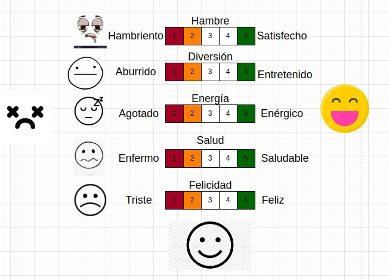
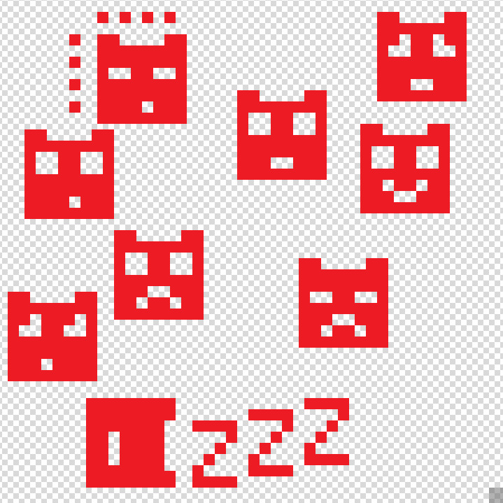
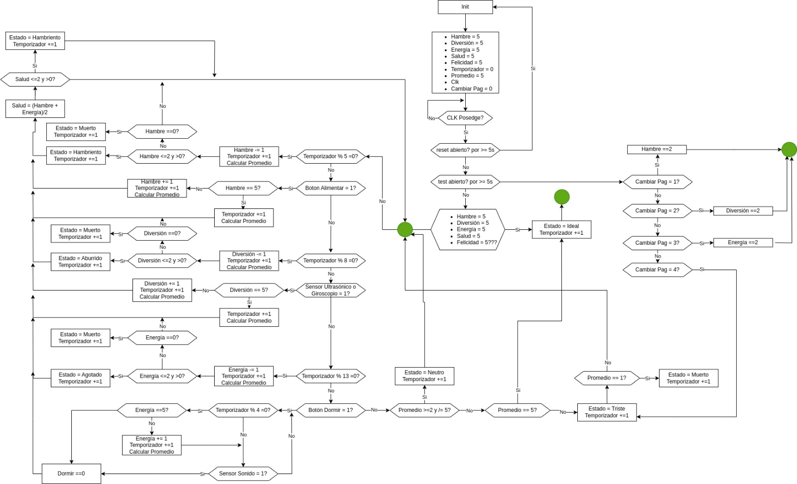
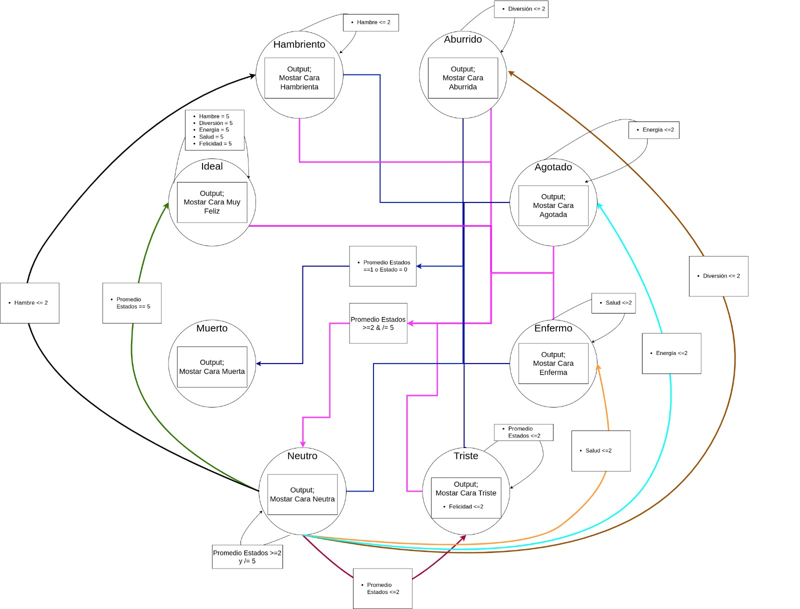

# Entrega 1 del proyecto WP01 <!-- omit in toc -->

**INTEGRANTES**
- Miguel Fabian Duarte Diaz
- Santiago Marín Becerra
- Juan David Palacios Chavez
- María Alejandra Pérez Petro

**TABLA DE CONTENIDO**
- [1. Objetivo](#1-objetivo)
- [2. Especificación](#2-especificación)
  - [2.1  Botones Mínimos](#21--botones-mínimos)
  - [2.2 Sistema de Sensado](#22-sistema-de-sensado)
  - [2.3 Sistema de Visualización](#23-sistema-de-visualización)
  - [2.4 Lógica de estados](#24-lógica-de-estados)
- [3. Diagrama de caja negra/funcional](#3-diagrama-de-caja-negrafuncional)
- [4. Propuesta Inicial de Arquitectura](#4-propuesta-inicial-de-arquitectura)
  - [4.1 Botones](#41-botones)
  - [4.2 Sensor de Movimiento](#42-sensor-de-movimiento)
  - [4.3 Pantalla LCD](#43-pantalla-lcd)

# 1. Objetivo
Desarrollar un sistema de Tamagotchi en FPGA (Field-Programmable Gate Array) que simule el cuidado de una mascota virtual. El diseño incorporará una lógica de estados para reflejar las diversas necesidades y condiciones de la mascota, junto con mecanismos de interacción incorporando sensores, botones y sistemas de visualización que permitan al usuario un uso optimo.

# 2. Especificación

## 2.1  Botones Mínimos
La interacción usuario-sistema se realizará mediante los siguientes cuatro botones:

- **Reset:** Reestablece el Tamagotchi a un estado inicial conocido al mantener pulsado el botón durante al menos 5 segundos. Este estado inicial simula el despertar de la mascota con salud óptima.
- **Test:** Activa el modo de prueba al mantener pulsado por al menos 5 segundos, permitiendo al usuario navegar entre los diferentes estados del Tamagotchi con cada pulsación.
- **Alimentar:** Permite alimentar a la mascota virtual. Cada pulsación aumenta un valor de "alimentación" en el sistema. Si la alimentación es insuficiente, la mascota virtual puede entrar en un estado de "hambre".
- **Jugar:** Permite jugar con la mascota virtual. Cada pulsación aumenta un valor de "Felicidad" en el sistema. Si la diversión es insuficiente, la mascota virtual puede entrar en un estado de "Tristeza".

- **Cambiar display 16x2:** Permite circular las estadísticas a mostrar en el display LCD 16x2. Cada pulsación cicla entre unas estadísticas a mostrar dando así al usuario el control para ver distintas estadísticas de la mascota virtual.

## 2.2 Sistema de Sensado
Para integrar al Tamagotchi con el entorno real y enriquecer la experiencia de interacción, se incorporará el sensor de movimiento MPU5050. Con este sensor el Tamagotchi podrá ejercitarse. La mascota tendrá tres formas de ejercitarse:
- **Caminar:** El usuario debe desplazarse (movimiento lineal en x) para darle la sensación de caminar al Tamagochi.
- **Levantar pesas:** El usuario debe levantar y bajar sus brazos (movimiento lineal en y) para darle la sensación de levantar pesas al Tamagochi.
- **Estirar:** El usaurio debe girar (movimiento angular en z) para darle la sensación de estirarse al Tamagochi.
 
Al ejercitarse el Tamagochi obtiene puntos de ejercicio que aportan a su salud. Si el ejercicio es insuficiente, la mascota virtual puede entrar en un estado de "inactividad".

Además se utilizará el sensor de sonido analógico y digital KY038. Se utilizará la salida digital del sensor, permitiendo que al detectar que se "habla" con el Tamagotchi, este "responda" con un buzzer integrando sonidos de distintas frecuencias. Los sonidos variarán dependiendo del estado de la mascota:

- **Feliz:** Cuando la mascota está feliz, el buzzer emitirá un sonido de alta frecuencia.
- **Triste:** Cuando la mascota está triste, el buzzer emitirá un sonido de baja frecuencia.
- **Hambriento:** Cuando la mascota tiene hambre, el buzzer emitirá un sonido de frecuencia media.
  
## 2.3 Sistema de Visualización

Se integrarán dos pantallas para la visualización de elementos del Tamagotchi. La primera es un display de 8x8 que se utilizará para mostrar la mascota virtual y sus distintos estados, proporcionando una representación visual de la mascota y sus emociones. La segunda es una pantalla LCD 16x2 que permitirá la visualización de los valores numéricos de las estadísticas de la mascota virtual. Esta pantalla mostrará información detallada sobre la salud, la felicidad, el hambre y otros aspectos de la mascota, permitiendo al usuario entender mejor las necesidades de su mascota virtual y responder en consecuencia.

 ## 2.4 Lógica de estados
El Tamagotchi tendrá una lógica de estados interna que reflejará las diversas necesidades y condiciones de la mascota. Los seis estados principales son los siguientes:

| Estado     | Binario | Decimal | Descripción                                                                                    |
| ---------- | ------- | ------ | ---------------------------------------------------------------------------------------------- |
| Ideal  | 000     | 0      | Estado inicial tras el reinicio. Estadisticas optimas.                               |
| Neutro  | 001     | 1      | La mascota está en buen estado.                                                                |
| Hambriento | 010     | 2      | La mascota necesita ser alimentada.                                                            |
| Tristeza   | 011     | 3      | La mascota se encuentra en mal estado.                                                                  |
| Agotado   | 100     | 4      | La mascota necesita Descansar.
| Aburrido  | 101   |   5      | La mascota necesita jugar.
| Enfermo    | 110     | 6      | La mascota no está saludable, es decir, sufre por hambre, falta de ejercicio y/o juego. |
|Muerto | 111 | 7 | La mascota murió.

Estos estados fluctuarán en base a las estadísticas individuales de cada atributo de la mascota, proporcionando una experiencia dinámica e interactiva para el usuario. Esta relación entre los atributos de la mascota y sus estados se puede visualizar en la siguiente imagen.

Con estos estados, se pueden visualizar en la pantalla diversas expresiones de la mascota. Estas expresiones permiten al usuario comprender fácilmente el estado actual de la mascota. Las siguientes ilustraciones proporcionan una representación visual de cada estado, facilitando así la interacción del usuario con la mascota virtual.

#  3. Diagrama de caja negra/funcional

## 3.1 Diagrama de Flujo

El siguiente diagrama de flujo proporciona una visión detallada de la funcionalidad integral del sistema Tamagotchi. Ilustra la interacción entre los diversos componentes del sistema, así como el procesamiento de las entradas y salidas. Este diagrama es esencial para entender cómo cada componente del sistema contribuye al funcionamiento general del Tamagotchi.

## 3.2 Diagrama de Moore

El siguiente diagrama de Moore es una representación gráfica de la lógica de estados del Tamagotchi. Este diagrama detalla cómo el estado del Tamagotchi cambia en respuesta a los atributos de la mascota y las acciones del usuario. Es una herramienta valiosa para entender cómo las acciones del usuario y los atributos de la mascota influyen en el estado del Tamagotchi.

#  4. Propuesta Inicial de Arquitectura
 

## 4.1 Botones

## 4.2 Sensor de Movimiento

## 4.3 Pantalla LCD