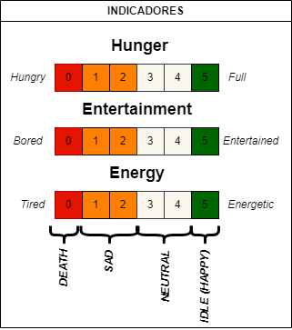

# Entrega 1 del proyecto WP01 <!-- omit in toc -->

**INTEGRANTES**
- Miguel Fabian Duarte Diaz
- Santiago Marín Becerra
- Juan David Palacios Chavez
- María Alejandra Pérez Petro

**TABLA DE CONTENIDO**
- [1. Objetivo](#1-objetivo)
- [2. Descripción General](#2-descripción-general)
  - [2.1  Botones Mínimos](#21--botones-mínimos)
  - [2.2 Sistema de Sensado](#22-sistema-de-sensado)
  - [2.3 Sistema de Visualización](#23-sistema-de-visualización)
- [3. Arquitectura del Sistema](#3-arquitectura-del-sistema)
  - [3.1 Diagrama de Caja Negra](#31-diagrama-de-caja-negra)
  - [3.2 Diagrama de Flujo](#32-diagrama-de-flujo)
  - [3.3 Diagrama de Moore](#33-diagrama-de-moore)
  - [3.4 Descripción de Componentes](#34-descripción-de-componentes)
    - [3.4.1 Botones](#341-botones)
    - [3.4.2 Sensor de Movimiento (Giroscopio)](#342-sensor-de-movimiento-giroscopio)
    - [3.4.3  Sensor de Sonido y Buzzer](#343--sensor-de-sonido-y-buzzer)
    - [3.4.5 Pantalla LCD 16x2](#345-pantalla-lcd-16x2)
- [4. Especificaciones Detalladas de Diseño](#4-especificaciones-detalladas-de-diseño)
  - [4.1 Modos de Operación](#41-modos-de-operación)
    - [4.1.1 Modo Test](#411-modo-test)
    - [4.1.2 Modo Normal](#412-modo-normal)
  - [4.2 Estados y Transiciones](#42-estados-y-transiciones)
    - [4.2.1 Estados](#421-estados)
    - [4.2.2 Transiciones](#422-transiciones)

# 1. Objetivo
Desarrollar un sistema de Tamagotchi en FPGA (Field-Programmable Gate Array) que simule el cuidado de una mascota virtual. El diseño incorporará una lógica de estados para reflejar las diversas necesidades y condiciones de la mascota, junto con mecanismos de interacción, tales como sensores, botones y sistema de visualización, los cuales permitan al usuario interactuar con la mascota virtual.

# 2. Descripción General

## 2.1  Botones Mínimos
La interacción usuario-sistema se realizará mediante los siguientes cinco botones:

- **Reset:** Reestablece el Tamagotchi a un estado inicial conocido al mantener pulsado el botón durante al menos 5 segundos. Este estado inicial simula el despertar de la mascota con salud óptima.
- **Test:** Activa el modo de prueba al mantener pulsado por al menos 5 segundos, permitiendo al usuario navegar entre los diferentes estados del Tamagotchi con cada pulsación.
- **Alimentar:** Permite alimentar a la mascota virtual. Cada pulsación aumenta un valor de "Hunger" en el sistema. Si la alimentación es insuficiente, la mascota virtual puede entrar en un estado de hambre.
- **Jugar:** Una pulsación activa el modo juego, el cual permite a la mascota aumentar su estadística de "Entertainment" en el sistema. 
- **Dormir:**  Una pulsación de este botón activa el modo dormir que permite a la mascota aumentar su estadística de "Energy".

## 2.2 Sistema de Sensado
Para integrar al Tamagotchi con el entorno real y enriquecer la experiencia de interacción, se incorporará lo siguiente:

- **sensor de ultra sonido HC-SR04:** con este sensor el Tamagotchi podrá jugar con el usuario, la mascota jugará mientras el usuario se encuentre a una distancia de 50cm del Tamagotchi.
 
- **sensor de sonido analógico y digital KY038:** se utilizará la salida digital del sensor, permitiendo que al detectar un ruido del usuario, el Tamagotchi se despierte.

- **buzzer:** el Tamagotchi podrá interactuar con el usuario mediante un buzzer manifestando diferentes sonidos dependiendo de como se esté sintiendo. Cada estado del Tamagotchi emitirá una cantidad de pulsos auditivos diferentes. 

- **giroscopio (mpu6050):**  se incorporará el sensor de movimiento MPU5050. Con este sensor el Tamagotchi simulará que camina cuando el usuario se desplace (movimiento lineal en x).

## 2.3 Sistema de Visualización

Se empleará una pantalla **LCD 16x2** para la visualización del Tamagochi. En ella se mostrará lo siguiente:
 - Representación visual de la mascota y sus emociones mediante gestos/caras. 
- Los valores numéricos junto con íconos de las estadísticas de la mascota virtual.  (1) Hunger, (2) Entertainment, y (3) Energy. 

De esta forma, el usuario podrá entender mejor las necesidades de su mascota virtual y responder en consecuencia.

#  3. Arquitectura del Sistema

El siguiente esquema representa el diagrama de caja negra inicial del proyecto. 

## 3.1 Diagrama de Caja Negra

Este diagrama presenta la arquitectura del Tamagotchi. Dado que el desarrollo es un proceso iterativo, es probable que ajustemos este modelo para adaptarlo mejor a las necesidades emergentes y a los hallazgos obtenidos durante las etapas de pruebas e integración.

## 3.2 Diagrama de Flujo

El siguiente diagrama de flujo proporciona una visión detallada de la funcionalidad integral del sistema Tamagotchi. Ilustra la interacción entre los diversos componentes del sistema, así como el procesamiento de las entradas y salidas. Este diagrama es esencial para entender cómo cada componente del sistema contribuye al funcionamiento general del Tamagotchi.

## 3.3 Diagrama de Moore

El siguiente diagrama de Moore es una representación gráfica de la lógica de estados del Tamagotchi. Este diagrama detalla cómo el estado del Tamagotchi cambia en respuesta a los indicadores de la mascota y las acciones del usuario. 

## 3.4 Descripción de Componentes

### 3.4.1 Botones

Se propone utilizar pulsadores como interfaz de interacción con los botones del Tamagotchi. Estos pulsadores estarán conectados a entradas del FPGA, permitiendo al sistema detectar las pulsaciones del usuario. Se utilizarán resistencias de pull-up para garantizar un estado definido en las entradas cuando no se estén pulsando los botones. Además se hará una descripción de hardware para mitigar el rebote mecánico de los botones mediante el módulo anti-rebote.

### 3.4.2 Sensor de Movimiento (Giroscopio)

El sensor de movimiento MPU6050 se conectará al FPGA mediante la interfaz I2C. La FPGA proporcionará el bus SCL al sensor y leerá los datos del sensor desde el bus SDA, para determinar el movimiento del usuario. Estos datos se procesarán para determinar si el usuario está "jugando" con el Tamagotchi. Por lo que, en la descripción de hardware se implementaran dos modulos uno para la comunicacion I2C (I2C master) y otro para el procesamiento de datos del giroscopio (girscopio controller). La salida del módulo de procesamiento de datos se utilizará para actualizar el estado del Tamagotchi y aumentar el nivel de "entertainment".

### 3.4.3  Sensor de Sonido y Buzzer
Para integrar el sensor de sonido KY038 y el buzzer en el sistema Tamagotchi, se propone un módulo que gestione la interacción con estos componentes. Este módulo será responsable de:

1. Lectura del sensor de sonido (micrófono): Leer la señal digital del sensor KY038 para detectar la presencia o ausencia de sonido.

2. Control del buzzer: Generar una señal que permita "interactuar" con el Tamagotchi, la cual variará en frecuencia de acuerdo al estado de animo del mismo.
   
### 3.4.5 Pantalla LCD 16x2
Se utilizará una pantalla LCD 16x2 para mostrar la mascota virtual y los puntajes de las estadisticas. Para ello, se implementará un modulo de LCD controller que reciba el estado actual de la mascota y sus puntajes y se encargue de enviarle a la pantalla las señales correspondientes de rs, rw, enable y data para lograr la visualización deseada. 

#  4. Especificaciones Detalladas de Diseño 

## 4.1 Modos de Operación

### 4.1.1 Modo Test

El modo test se activa al presionar por 5 segundos el botón de test, posterior a esto cada vez que se pulse el botón de test, se hará una transición por todos los estados del Tamagotchi. Estos cambios se deberán ver reflejados en pantalla mediante las caras ilustradas y mediante los niveles mostrados.

### 4.1.2 Modo Normal

La funcionalidad regular del Tamagotchi es la siguiente:

* Recién se enciende la FPGA y se carga la descripción de hardware el Tamagotchi entra a su estado inicial e ideal llamado "IDLE". En este estado, el Tamagotchi tiene todos sus indicadores al máximo, es decir "hunger = 5", "entertainment = 5" y "energy=5". Este estado inicial se puede visualizar en pantalla mediante una carita feliz. 

* Posteriormente y con el avance del tiempo, los indicadores van  ir disminuyendo de a 1 punto de tal manera que cuando ya no están todos en 5 el Tamagotchi entra a un estado denominado "NEUTRAL". Este estado se presenta siempre que todos los niveles sean mayores a 2.

* Desde el estado anterior, el Tamagotchi puede cambiar a tres estados los cuales se dan cuando uno de los tres indicadores (hunger, entertainment o energy) se encuentra en un nivel menor o igual a 2. Los estados a los que puede entrar son: 

  * "BORED" cuando el nivel de "entertainment" es el  único indicador que está por debajo de 2. Se muestra una cara representando aburrimiento.

  * "TIRED" cuando el nivel de "energy" es el  único indicador que está por debajo de 2. Se muestra una cara representando somnolencia.

  * "HUNGRY" cuando el nivel de "hunger" es el único indicador que está por debajo de 2. Se muestra una cara representando hambre.

* Dado el caso en que mas de un nivel esté por debajo de 2 se entra a un estado denominado "SAD" en el cual el Tamagotchi muestra una cara triste e indica a el usuario que debe hacer algo para aumentar el nivel de los indicadores.

* Si el Tamagotchi se encuentra en el estado "SAD" lo suficiente para que un indicador llegue a 0. Este pasa el estado denominado "DEATH" , en el cual el Tamagotchi muere y donde ya el usuario no puede interactuar con el mismo. La única manera para sacar al Tamagotchi de este estado es mediante la pulsación del botón de reset el cual regresa al Tamagotchi al estado de "IDLE".

* Si en cualquiera de los estados se presiona el botón de "sleep" y además no está presionado el botón play y además el nivel de energía es diferente de 5, el Tamagotchi entra el estado "SLEEP". En este estado el Tamagotchi recupera con el avance del tiempo su indicador de "energy" lo cual lo puede ayudar a salir de los estados "SAD" o "TIRED" y que llegue a un estado "NEUTRAL" o incluso "IDLE" (solo si todos los indicadores están en 5.) Para salir del estado sleep hay tres opciones:

  * Se hace algún ruido lo suficiente mente alto para que el micrófono lo detecte y se despierte el Tamagotchi, se presiona el botón de "feed" para que el Tamagotchi se despierte a comer, o el si el Tamagotchi ya durmió lo suficiente y el nivel de "energy =5". Una vez despierto, el Tamagotchi entrará al estado correspondiente, dependiendo del nivel de sus tres indicadores.

* Si en cualquiera de los estados se presiona el botón de "play" y además no está presionado el botón "sleep y además el nivel de entertainment es diferente de 5, el Tamagotchi entra el estado "PLAYING". En este estado el Tamagotchi recupera con el avance del tiempo su indicador de "entertainment" lo cual lo puede ayudar a salir de los estados "SAD" o "BORED" y que llegue a un estado "NEUTRAL" o incluso "IDLE" (solo si todos los indicadores están en 5.) Para salir del estado playing es necesario que se deje de mover el giroscopio ya que este sensor es el que indica posterior a presionado el botón de jugar, que el Tamagotchi está jugando. El Tamagotchi también sale del estado "PLAYING" si el nivel de entertainment llega a 5. 

Finalmente es importante recalcar que el nivel de "hunger" se controla con el botón "feed" el cual al presionarlo, le da una galleta al Tamagotchi y el nivel de alimentación sube. Esto puede ayudar a que el Tamagotchi salga del estado de "HUNGRY". Con esto se concluye la descripción del modo normal de operación del Tamagotchi.

## 4.2 Estados y Transiciones

### 4.2.1 Estados 
Como se describió de manera detallada en el apartado anterior, el Tamagotchi tendrá una lógica de estados interna que reflejará las diversas necesidades y condiciones de la mascota. Los ocho estados principales son los siguientes:

| Estado     | Binario | Decimal |Descripción                                       |
| ---------- | ------- | ------ | -------------------------------------------------- |
| IDLE  | 0000     | 0      | Estado inicial tras reset. Estadisticas optimas. |
| NEUTRAL  | 0001     | 1      | La mascota está en buen estado. |
| TIRED   | 0010     | 2      | La mascota necesita dormir para descansar. |
| SLEEP   | 0011     | 3      | La mascota está dormida. |
| HUNGRY | 0100     | 4      | La mascota necesita ser alimentada.  |
| SAD   | 0101     | 5      | La mascota se encuentra en mal estado.  Sus niveles de alimentación, energia y diversión están bajos. |
| PLAYING  | 0110   |   6      | La mascota está jugando. |
| BORED  | 0111   |   7      | La mascota necesita jugar. |
| DEAD | 1000 | 8 | La mascota murió.|

Estos estados fluctuarán en base a los niveles de cada indicador de la mascota, proporcionando una experiencia dinámica e interactiva para el usuario. Por cada estado se visualizará en la pantalla LCD 16x2 diversas expresiones de la mascota.

### 4.2.2 Transiciones 

**Temporizadores**

Existen tres temporizadores los cuales controlan cada uno de los indicadores del Tamagotchi. Los temporizadores son los siguientes:
  * **Ener**: Es el temporizador de energía, el cual indica que cada 40 segundos disminuye en 1 el nivel de energía o si está dormido, cada 40 segundos que esté dormido, aumenta el nivel de energía en 1.
  
  * **Feed**: Es el temporizador de hambre, el cual indica que cada 10 segundos disminuye en 1 el nivel de alimentación.

  * **Entert**: Es el temporizador de diversión, el cual indica que cada 20 segundos disminuye en 1 el nivel de entretenimiento o si está jugando, cada 20 segundos que esté jugando, aumenta el nivel de entretenimiento en 1.
  
**Interacciones**

El usuario interactúa con el Tamagotchi mediante los botones "Feed", "Sleep", "Play", "Test" y "Reset" y mediante lo sensores de Audio, Giroscopio y Ultrasonido.

* Con el botón "Feed" aumenta el indicador de alimentación en 1 punto de 5 posible.
* Con el botón "Sleep" el Tamagotchi entra al estado dormir en donde cada 40 segundos aumenta en 1 el indicador de energía.
* Con el una interacción sonora detectada por el micrófono el Tamagotchi sale del estado "SLEEP".
* Con el botón "PLAY" on una interacción con el sensor ultrasonido el Tamagotchi entra en el estado de jugar en el cual revisa si se está moviendo el giroscopio para poder aumentar cada 20 segundos el nivel de entertainment.
* Una pulsación del botón reset regresa el Tamagotchi al estado "IDLE" en donde todos los indicadores regresan a su nivel máximo de 5.
* El botón test, hace que el Tamagotchi entre al modo test descrito anteriormente.

**Sistema de Niveles o Puntos**

El sistema de niveles o puntos se ilustra en la siguiente figura:

