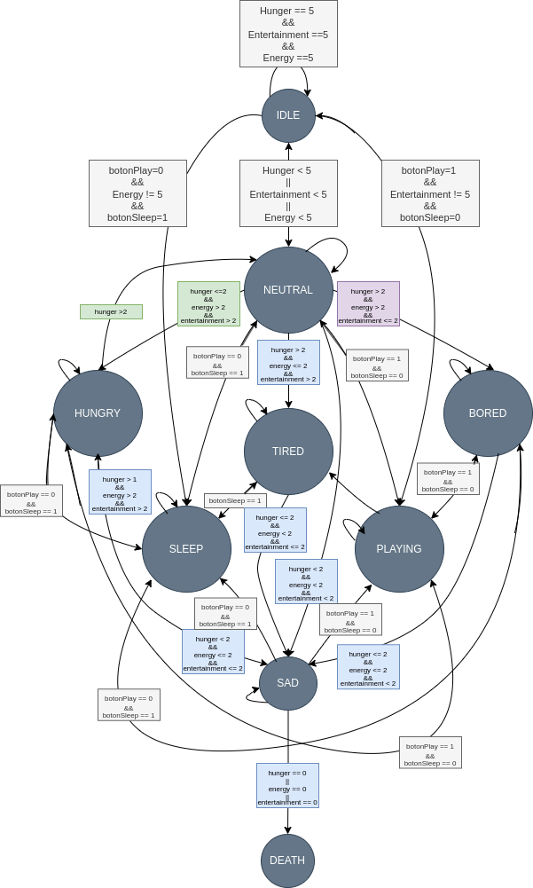

# Entrega 1 del proyecto WP01 <!-- omit in toc -->

**INTEGRANTES**
- Miguel Fabian Duarte Diaz
- Santiago Marín Becerra
- Juan David Palacios Chavez
- María Alejandra Pérez Petro

**TABLA DE CONTENIDO**
- [1. Objetivo](#1-objetivo)
- [2. Especificación](#2-especificación)
  - [2.1  Botones Mínimos](#21--botones-mínimos)
  - [2.2 Sistema de Sensado](#22-sistema-de-sensado)
  - [2.3 Sistema de Visualización](#23-sistema-de-visualización)
  - [2.4 Lógica de estados](#24-lógica-de-estados)
- [3. Diagrama de caja negra/funcional](#3-diagrama-de-caja-negrafuncional)
  - [3.1 Diagrama de Caja Negra](#31-diagrama-de-caja-negra)
  - [3.2 Diagrama de Flujo](#32-diagrama-de-flujo)
  - [3.3 Diagrama de Moore](#33-diagrama-de-moore)
- [4. Propuesta Inicial de Arquitectura](#4-propuesta-inicial-de-arquitectura)
  - [4.1 Botones](#41-botones)
  - [4.2 Sensor de Movimiento](#42-sensor-de-movimiento)
  - [4.3  Sensor de Sonido y Buzzer](#43--sensor-de-sonido-y-buzzer)
  - [4.4 Matriz 8x8](#44-matriz-8x8)
  - [4.5 Pantalla LCD 16x2](#45-pantalla-lcd-16x2)

# 1. Objetivo
Desarrollar un sistema de Tamagotchi en FPGA (Field-Programmable Gate Array) que simule el cuidado de una mascota virtual. El diseño incorporará una lógica de estados para reflejar las diversas necesidades y condiciones de la mascota, junto con mecanismos de interacción incorporando sensores, botones y sistemas de visualización que permitan al usuario interactuar con la mascota virtual.

# 2. Especificación

## 2.1  Botones Mínimos
La interacción usuario-sistema se realizará mediante los siguientes cinco botones:

- **Reset:** Reestablece el Tamagotchi a un estado inicial conocido al mantener pulsado el botón durante al menos 5 segundos. Este estado inicial simula el despertar de la mascota con salud óptima.
- **Test:** Activa el modo de prueba al mantener pulsado por al menos 5 segundos, permitiendo al usuario navegar entre los diferentes estados del Tamagotchi con cada pulsación.
- **Alimentar:** Permite alimentar a la mascota virtual. Cada pulsación aumenta un valor de "alimentación" en el sistema. Si la alimentación es insuficiente, la mascota virtual puede entrar en un estado de hambre.
- **Jugar/Dormir:** Una pulsación activa el modo juego, el cual permite a la mascota aumentar su estadística de "Diversión" en el sistema. Por otra parte, mantener pulsado por al menos 5 segundos activa el modo dormir que permite a la mascota aumentar su estadística de "Energia".
- **Cambiar display 16x2:** Permite circular las estadísticas a mostrar en el display LCD 16x2. Cada pulsación cicla entre unas estadísticas a mostrar dando así al usuario el control para ver distintas estadísticas de la mascota virtual.

## 2.2 Sistema de Sensado
Para integrar al Tamagotchi con el entorno real y enriquecer la experiencia de interacción, se incorporará el sensor de movimiento MPU5050. Con este sensor el Tamagotchi podrá jugar. La mascota tendrá tres formas de jugar:
- **Caminar:** El usuario debe desplazarse (movimiento lineal en x) para darle la sensación de caminar al Tamagochi.
- **Levantar pesas:** El usuario debe levantar y bajar sus brazos (movimiento lineal en y) para darle la sensación de levantar pesas al Tamagochi.
- **Estirar:** El usaurio debe girar (movimiento angular en z) para darle la sensación de estirarse al Tamagochi.
 

Además se utilizará el sensor de sonido analógico y digital KY038. Se utilizará la salida digital del sensor, permitiendo que al detectar que se "habla" con el Tamagotchi, este "responda" con un buzzer integrando sonidos de distintas frecuencias. Los sonidos variarán dependiendo del estado de la mascota:

- **Feliz:** Cuando la mascota está feliz, el buzzer emitirá un sonido de alta frecuencia.
- **Triste:** Cuando la mascota está triste, el buzzer emitirá un sonido de baja frecuencia.
- **Hambriento:** Cuando la mascota tiene hambre, el buzzer emitirá un sonido de frecuencia media.
  
## 2.3 Sistema de Visualización

Se empleará una pantalla **Pantalla LCD 16x2** para la visualización de de del Tamagochi. En ella se mostrará lo siguient:
 - representación visual de la mascota y sus emociones mediante gestos/caras. 
- los valores numéricos de las estadísticas de la mascota virtual.  (1) alimentación, (2) diversión, (3) energia, (4) salud y (5) felicidad. 
De esta forma, el usuario podrá entender mejor las necesidades de su mascota virtual y responder en consecuencia.

 ## 2.4 Lógica de estados
El Tamagotchi tendrá una lógica de estados interna que reflejará las diversas necesidades y condiciones de la mascota. Los ocho estados principales son los siguientes:

| Estado     | Binario | Decimal |Descripción                                       |
| ---------- | ------- | ------ | -------------------------------------------------- |
| Ideal  | 0000     | 0      | Estado inicial tras reset. Estadisticas optimas. |
| Neutro  | 0001     | 1      | La mascota está en buen estado. |
| Agotado   | 0010     | 2      | La mascota necesita dormir para descansar. |
| Durmido   | 0011     | 3      | La mascota está dormida. |
| Hambriento | 0100     | 4      | La mascota necesita ser alimentada.  |
| Triste   | 0101     | 5      | La mascota se encuentra en mal estado.  Sus niveles de alimentación, energia y diversión están bajos. |
| Jugando  | 0110   |   6      | La mascota está jugando. |
| Aburrido  | 0111   |   7      | La mascota necesita jugar. |
|Muerto | 1000 | 8 | La mascota murió.|

Estos estados fluctuarán en base a las estadísticas individuales de cada indicador de la mascota, proporcionando una experiencia dinámica e interactiva para el usuario. Para cada estado se visualizará en la matrix 8x8 diversas expresiones de la mascota.

#  3. Diagrama de caja negra/funcional

El siguiente esquema representa el diagrama de caja negra inicial del proyecto. Este diagrama está sujeto a cambios a medida que el proyecto avanza y se implementan optimizaciones o se identifican protocolos adicionales necesarios que actualmente son desconocidos. Dado que el desarrollo es un proceso iterativo, es probable que ajustemos este modelo para adaptarlo mejor a las necesidades emergentes y a los hallazgos obtenidos durante las etapas de prueba y evaluación.

## 3.1 Diagrama de Caja Negra

El protocolo I2C, un método de comunicación serial ampliamente adoptado, se emplea en este proyecto para conectar el microcontrolador con varios dispositivos periféricos. Específicamente, se utiliza para la integración del giroscopio y para la comunicación con la pantalla LED de 16x2. La flexibilidad del protocolo I2C también permitirá su futura extensión a otros sensores que se añadirán en las etapas subsiguientes del desarrollo. Esta capacidad de expansión asegura que podemos adaptar y escalar nuestro sistema fácilmente conforme evolucionen nuestras necesidades técnicas.

El protocolo SPI se empleará principalmente para la visualización de imágenes en la Matriz LED 8x8, ya que permite reducir el número de pines necesarios y acelera significativamente la transferencia de datos.

En la sección de Estados, se recibirá el estado actual de la mascota y se procesarán las imágenes correspondientes que serán enviadas al protocolo SPI para su reproducción en la matriz 8x8. Este módulo contendrá todos los dibujos representativos de los distintos estados de la mascota, listos para ser mostrados según sea necesario.

En Calculo de Estados, se realizarán todos los procesor logicos para determinar el estado de la mascota, además allí será donde entren algunas interacciones con sensores como los botones que alimentan o hacen dormir a la mascota, con ello aumentar o disminuir ciertos estados dependiendo las interacciones del usuario.

En el módulo de Cálculo de Estados, se llevarán a cabo todos los procesos lógicos necesarios para determinar el estado actual de la mascota. Además, este será el lugar donde se gestionen diversas interacciones con sensores, como los botones que permiten alimentar o hacer dormir a la mascota. Estas interacciones influirán en el ajuste de ciertos estados, variando según las acciones del usuario.

En el módulo de Memoria, como su nombre indica, se almacenarán los valores relevantes que se deben mostrar al usuario en la pantalla LED 16x2. Esto se realiza con el fin de proporcionar una experiencia más completa y satisfactoria al usuario.

## 3.2 Diagrama de Flujo

El siguiente diagrama de flujo proporciona una visión detallada de la funcionalidad integral del sistema Tamagotchi. Ilustra la interacción entre los diversos componentes del sistema, así como el procesamiento de las entradas y salidas. Este diagrama es esencial para entender cómo cada componente del sistema contribuye al funcionamiento general del Tamagotchi.

## 3.3 Diagrama de Moore

El siguiente diagrama de Moore es una representación gráfica de la lógica de estados del Tamagotchi. Este diagrama detalla cómo el estado del Tamagotchi cambia en respuesta a los indicadores de la mascota y las acciones del usuario. 

#  4. Propuesta Inicial de Arquitectura
 
## 4.1 Botones

Se propone utilizar pulsadores como interfaz de interacción con los botones del Tamagotchi. Estos pulsadores estarán conectados a entradas del FPGA, permitiendo al sistema detectar las pulsaciones del usuario. Se utilizarán resistencias de pull-up para garantizar un estado definido en las entradas cuando no se estén pulsando los botones.

## 4.2 Sensor de Movimiento

El sensor de movimiento MPU6050 se conectará al FPGA mediante la interfaz I2C. El FPGA leerá los datos del sensor, incluyendo la aceleración y el giroscopio, para determinar el movimiento del usuario. Estos datos se procesarán para determinar si el usuario está caminando, levantando pesas o estirando, en base a los patrones de movimiento detectados. Por lo que, en la descripción de hardware con vHDL se implementaran dos modulos uno para la comunicacion I2C y otro para el procesamiento de datos del giroscopio. Los dos módulos VHDL se integrarán en un sistema completo que gestione la comunicación con el sensor MPU6050, procese sus datos y determine el movimiento del usuario. La salida del módulo de procesamiento de datos se utilizará para actualizar el estado del Tamagotchi.

## 4.3  Sensor de Sonido y Buzzer
Para integrar el sensor de sonido KY038 y el buzzer en el sistema Tamagotchi, se propone un módulo VHDL que gestione la interacción con estos componentes. Este módulo será responsable de:

1. Lectura del sensor de sonido: Leer la señal digital del sensor KY038 para detectar la presencia o ausencia de sonido.

2. Control del buzzer: Generar una señal de onda cuadrada de la frecuencia adecuada en función del estado de la mascota virtual (feliz, triste o hambriento). Asi como, controlar la duración del sonido emitido por el buzzer.
   
## 4.4 Matriz 8x8
Para mostrar el Tamagotchi en una matriz LED 8x8, se propone un módulo VHDL que gestione la comunicación con la matriz mediante protocolo SPI y la visualización de las diferentes caras del tamagotchi.

## 4.5 Pantalla LCD 16x2
Se utilizará una pantalla LCD 16x2 para mostrar las estadísticas de la mascota virtual. La pantalla se conectará al FPGA mediante protocolo SPI. El FPGA enviará los datos de las estadísticas a la pantalla para que se muestren en el formato correspondiente.
